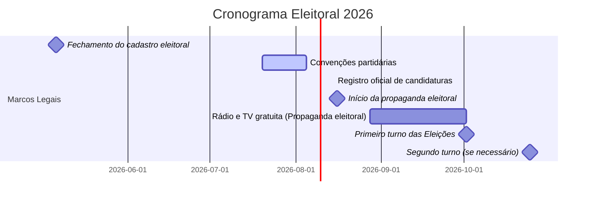

# Relatório Analítico: Corrida Presidencial 2026 no Brasil

**Resumo Executivo:** A corrida presidencial de 2026 ainda não tem candidatos oficiais registrados (a janela partidária e registro só ocorrem em 2026). Porém, vários políticos já se declararam pré-candidatos ou são cotados. Entre os nomes em destaque estão o atual presidente **Lula (PT)**, que anunciou sua reeleição (com vice Geraldo Alckmin)【25†L92-L95】, e o senador **Flávio Bolsonaro (PL)**, que lançou pré-candidatura em evento conservador internacional【32†L53-L58】. Outros postulantes incluem Romeu Zema (Novo), Ronaldo Caiado (PSD), Renan Santos (Missão), Aldo Rebelo (DC), Samara Martins (UP), Hertz Dias (PSTU), Cabo Daciolo (Mobiliza) e Rui Costa Pimenta (PCO). Pesquisas recentes apontam empate técnico Lula×Flávio no 1º turno【50†L74-L82】【53†L72-L80】, com Flávio ligeira vantagem em cenários de 2º turno (ex.: Futura 48%×42%)【56†L114-L120】. Cenários mais prováveis incluem um 2º turno Lula vs Flávio, com resultado aberto; menos provável, vitória em 1º turno de Lula; improvável, surgimento de “outsider” (e.g. Ciro Gomes) no segundo turno. Na hipótese Lula vencedor, seguiria a política de programas sociais e maior protagonismo em acordos multilaterais; no cenário Flávio, esperar-se-ia austeridade fiscal, corte de gastos públicos, linha dura na segurança e realinhamento conservador (p.ex. maior proximidade EUA)【31†L241-L249】【32†L53-L58】. Os principais riscos eleitorais incluem desgaste econômico (inflação/desemprego), polarização política intensa, contestações judiciais (fake news, inelegibilidades) e surpresas de última hora. O cronograma eleitoral prevê fechamento do cadastro em 6/5/2026, convenções partidárias entre 20/7–5/8, registro de candidaturas em 15/8, campanha oficial de 16/8 a 29/9 (propaganda paga: 28/8–1/10) e primeiro turno em 2/10/2026【4†L371-L379】【69†L1-L4】. A seguir, detalhamos candidatos, propostas, pesquisas, eventos, cenários, implicações, riscos e o calendário legal, com fontes citadas.

## 1. Candidatos (Pré-candidatos) Registrados e Coligações

Não há lista oficial de candidaturas até a convenção partidária de 2026. Os nomes abaixo são os principais pré-candidatos declarados ou cogitados, com partidos, possíveis coligações e vice conhecidos (caso anunciado). Em geral, as coligações formais só serão definidas após 5/8/2026. Para informação faltante, indicamos “não especificado”.

| **Candidato (partido)**         | **Coligação (situação)**            | **Vice**                      | **Fonte**                                             |
|---------------------------------|------------------------------------|-------------------------------|-------------------------------------------------------|
| **Luiz Inácio Lula da Silva (PT)**   | A definir (PT + aliados de esquerda) | Geraldo Alckmin (PSB) – já confirmado【25†L92-L95】 |  Redes sociais de campanha【25†L92-L95】       |
| **Flávio Bolsonaro (PL)**           | A definir (PL + candidatos conservadores) | Não divulgado               |  Declarações e entrevistas【32†L53-L58】        |
| **Ronaldo Caiado (PSD)**             | PSD (apos saída da federação PSDB/União Progressista) | Não divulgado               |  Lançamento no PSD (30/3/26)【64†L42-L50】     |
| **Romeu Zema (Novo)**                | Novo (partido solo, sem coligação) | Não divulgado               |  Entrevistas e colunas【34†L115-L123】        |
| **Renan Santos (Missão Agora)**      | Missão (pequeno partido de direita)   | Não divulgado               |  Entrevista em PG【37†L154-L163】【37†L167-L171】 |
| **Aldo Rebelo (Democracia Cristã)**  | Democracia Cristã (DC)              | Não divulgado               |  Fórum LIDE-MT【29†L81-L86】【39†L107-L115】 |
| **Ciro Gomes (PSDB)**               | PSDB (a ser confirmado após convite de Aécio) | Não divulgado       |  Aécio convidou para PSDB【20†L69-L73】        |
| **Samara Martins (Unidade Popular)** | UP (esquerda radical)                | Não divulgado               |  Anúncio oficial em 8/3 (Mulher)【62†L1081-L1090】 |
| **Hertz Dias (PSTU)**               | PSTU                               | Não divulgado               |  Lançamento em congresso do PSTU【42†L143-L146】 |
| **Cabo Daciolo (Mobiliza)**         | Mobiliza (fundações PMN)           | Não divulgado               |  Anúncio por redes (04/4/26)【46†L111-L114】    |
| **Rui Costa Pimenta (PCO)**        | PCO (Partido da Causa Operária)   | Não divulgado               |  Divulgações partidárias                         |
| **Outros nomes citados:**          | Outros partidos pequenos           | –                            |  (e.g., Edmilson Costa/PCB nas redes)【27†L58-L66】  |

Cada partido decide seu vice em convenção. No momento, só há vice oficializado: Geraldo Alckmin como vice de Lula【25†L92-L95】. As coligações partidárias formais (federações e alianças) ainda se definem.

## 2. Plataformas e Propostas Principais

As propostas por candidato ainda estão em definição, já que poucos lançaram plataformas completas. Seguem-se os temas centrais identificados até abril/2026:

- **Lula (PT)**: Continuar o foco em programas sociais (Bolsa Família / Brasil Auxílio), ampliação do SUS e de verbas para educação pública. Prometeu ressaltar a “governança democrática” e combate à desigualdade【29†L58-L62】. Raramente detalha novas medidas – parte do projeto é consolidar a recuperação econômica atual e fortalecer alianças internacionais (Brics e acordos multilaterais). *Não há plataforma detalhada divulgada para 2026; parte-se do contexto atual do governo.*  

- **Flávio Bolsonaro (PL)**【31†L241-L249】【32†L53-L58】: Anuncia compromisso de ficar só um mandato e **responsabilidade fiscal** rígida. Promete cortes de gastos públicos e tributos (“tesourada em cargos, impostos, corrupção” etc.)【31†L241-L249】, revisão das reformas da Previdência e trabalhista e teto de gastos. Em segurança, defende combate “rígido” ao crime organizado【32†L53-L58】. Na política externa, promete estreitar laços com EUA e se posiciona contra “influências comunistas” (p.ex. crítica à China)【32†L69-L73】. Na área ambiental, combate agendas que considera “radicais”【32†L53-L58】, insinuando flexibilizar regulações para mineração e agropecuária. Promete maior vigilância internacional nas eleições brasileiras.  

- **Romeu Zema (Novo)**【34†L115-L123】: Adota agenda liberal: amplia jornada de trabalho sem limites e paga por hora trabalhada, privatização total de estatais (incluindo Petrobras e Caixa) e nova **reforma da Previdência** mais dura【34†L115-L123】. Defende reduzir o “custo Brasil” com menos burocracia e impostos (ex.: ampliar teto do Simples Nacional)【34†L115-L123】. Em educação/saúde, tende a manter ensino público básico e SUS, mas sem planos concretos divulgados. Em segurança, apoia a redução de leis restritivas ao porte de armas (herança do governo anterior do Novo) e combate à criminalidade com policiamento forte. Enfatiza tecnologia e eficiência governamental no meio ambiente (p.ex. desenvolvimento de “economia verde” de baixo carbono). 

- **Ronaldo Caiado (PSD)**【72†L7-L16】: Foca em economia doméstica: critica alto endividamento das famílias (80 milhões de inadimplentes) e prioriza a “saúde financeira” do cidadão【72†L7-L16】. Propõe controle da inflação (políticas antiinflação), negociações de dívidas de baixa renda e facilitação de crédito. Em educação/saúde, promete fortalecer hospitais e escolas públicas (dada sua ênfase em áreas vitais), mas detalhes não foram divulgados. Em segurança, defende endurecer o sistema judiciário e reprimir facções do tráfico (baseado em seu histórico de stances de direita). No exterior, sugere progredir com acordos de livre-comércio (sinalizando pragmatismo econômico). Não há proposta ambiental definida, mas sendo ruralista histórico, tende a apoiar o agronegócio com infraestrutura logística (ex.: apoio à Ferrogrão como revelou em MT)【39†L107-L115】.

- **Renan Santos (Missão)**【37†L154-L163】【37†L167-L171】: Ex-ativista do MBL, defende liberalismo econômico e dureza na segurança. Propõe modernizar a infraestrutura logística (estradas e ferrovias) para escoar a produção, especialmente do agronegócio do Sul – estradas duplicadas e fundir municípios economicamente inviáveis【37†L154-L163】【37†L179-L181】. Critica corrupção e promete “direito rápido e duro” para combater criminalidade (drogas e milícias)【37†L167-L171】. Economicamente, quer diminuir intervenção estatal, mas não detalhou programas sociais. Em meio ambiente, foca em desenvolvimento econômico sustentável (menor ênfase ecológica, mais investimento em agronegócio).  

- **Aldo Rebelo (DC)**【39†L107-L115】: Ex-ministro, enfatiza desenvolvimento regional (especialmente MT). Defende grande investimento em logística: concluir a Ferrogrão (contrária à travas judiciais)【39†L107-L115】 e criar rotas comerciais pelo Pacífico para escoar grãos. Sustenta que o agro mato-grossense “sustenta” a balança comercial do país【39†L107-L115】. Na educação, sugere integrar agronegócio com indústria (formação técnica). Em segurança, prega cooperação federativa e modernização das polícias. Não detalhou política externa específica, mas deve priorizar interesses do agronegócio (ex.: parcerias Mercosul-Pacífico).  

- **Samara Martins (UP)**【44†L135-L142】【44†L171-L174】: Militante negra do PSOL/UP. Propõe políticas socialistas: “fim da terceirização/pejotização e jornada 6×1” (cite sua crítica ao trabalho excessivo) e aumento significativo de salários e investimentos públicos. Na saúde e educação, exige que políticos e familiares usem **exclusivamente SUS e escolas públicas** para alinhá-los às necessidades da população【44†L135-L142】【44†L171-L174】. Isso elevaria recursos para serviços públicos. Também defende mais atenção à violência contra mulheres e negros (ampliação de abrigos e delegacias especializadas). Em segurança, é contra políticas punitivas e propõe programas sociais para juventude. 

- **Hertz Dias (PSTU)**【42†L143-L146】: De esquerda radical, quer revogar as reformas trabalhista e previdenciária, dobrar salário mínimo e ampliar isenção do Imposto de Renda para os mais pobres【42†L143-L146】. Proíbe a escala 6×1 (fim do trabalho aos sábados) e legaliza greve geral. Defende financiamento público universal (Educação e Saúde gratuitos) e estatização de setores estratégicos. Rejeita aliança com capital privado, luta contra qualquer reforma liberal. Em segurança, prioriza direitos humanos (contrário à “linha dura” bolsonarista) e ampliação de sistemas de justiça social.

- **Cabo Daciolo (Mobiliza)**: Ex-deputado evangélico. Lança campanha com forte carga religiosa e nacionalista. Ainda sem plataforma estruturada; ele não divulga detalhamentos concretos, focando em discursos midiáticos. Em 2018, defendeu políticas sociais direcionadas a famílias brasileiras (aumentar auxílio a trabalhadores pobres) e imigrantes (prioridade nacional). Repetiu críticas a elites (“não estou à venda para o sistema”). Em geral, propõe milícia patriótica e ataca “globalismo” e marxismo, mas não há programa econômico claro.

- **Rui Costa Pimenta (PCO)**: De extrema-esquerda, defende medidas revolucionárias: estatização total dos bancos e grandes empresas, reestruturação agrária radical, moratória da dívida pública. Aumentaria salário e expandiria massivamente serviços públicos, com foco em lutar contra “grandes empresários” e imperialismo. Propõe alianças com partidos comunistas e sindicatos.  

Para vários candidatos menores (por exemplo **Michelle Bolsonaro/PL**, **Eduardo Leite/PSD**, **Simone Tebet/MDB** etc.), não há candidaturas firmes ou plataformas neste momento – incluímos somente quem se declarou ou foi oficialmente lançado até abril/2026. Dados não encontrados acima são indicados como *não especificados*.

## 3. Pesquisas de Intenção de Voto

Diversos institutos têm feito sondagens em 2026. Em geral, Lula e Flávio lideram empatados dentro da margem de erro. A tabela a seguir resume pesquisas recentes:

| Instituto / Data      | Lula (PT) | Flávio (PL) | 3º Lugar (ex.)       | Indecisos/Brancos | Amostra/Marg. de Erro  |
|----------------------|-----------|-------------|----------------------|-------------------|------------------------|
| **Gerp** – 27.mar.26【50†L74-L82】    | 38%       | 36%         | 3º= Ciro 7%           | 6% (Nenhum/NV)      | 2000 / ±2,24pp【51†L13-L16】 |
| **Paraná Pesquisas** – 25–28.mar.26【55†L72-L79】 | 41.3%     | 37.8%       | 3º= Caiado 3.6%       | 7.5% (Nulos+ND)    | 2080 / ±2,2pp【55†L92-L95】 |
| **Futura Inteligência** – 14.abr.26【56†L69-L78】 | 39.8%     | 37.3%       | 3º= Caiado 4.8%       | 11.6% (Branco/ND)  | 2000 / ±2,2pp【57†L1-L4】 |
| **Genial/Quaest** – 15.abr.26【53†L72-L80】  | 37%       | 32%         | 3º= Caiado 6%         | 16% (Branco/ND)    | 2004 / ±2pp【54†L7-L10】 |
| *Fontes:* institutos Gerp【50†L74-L82】, Paraná【55†L72-L79】, Futura【56†L69-L78】, Quaest【53†L72-L80】. Bolsas positivas esperam Lula; PSDB (Ciro) e PSD (Ratinho, hoje fora) perdem espaço.

**Tendências:** Todas as pesquisas mostram empate técnico entre Lula e Flávio no 1º turno【50†L74-L82】【53†L72-L80】. Lula lidera levemente em algumas (Paraná 41,3%×37,8%), mas Flávio tem avançado (em sp. espontâneo Lula 35%, Flávio 22,9% na Futura【56†L58-L66】). Em cenário estimulado, Lula tem 37–41% e Flávio 32–38% (diferença dentro da margem). Para 2º turno, o cenário Lula×Flávio fica tecnicamente empatado: Futura deu Flávio 48% × Lula 42%【56†L114-L120】, Paraná deu Flávio 45,2%×Lula 44,1%【55†L85-L90】, e Gerp 48%×45%【50†L133-L140】. Nas simulações com outros adversários (Caiado, Zema, Ciro), Lula vence por margens moderadas (ex.: Quaest mostra Lula 44%× Caiado 35% e 45%×Zema 41%【53†L97-L101】). A rejeição a Lula é mais alta que a de Flávio, mas Lula é mais conhecido【53†L137-L145】【53†L143-L151】.  

> **Análise:** A convergência indica um cenário polarizado, semelhante a 2022. O empate técnico e as simulações de segundo turno sugerem que ambos têm chances reais. Qualquer mudança relevante (uma grande crise econômica, escândalo de um dos líderes, ou algum “outsider” emergente) pode alterar o cenário. Até agora, não há tendência clara de queda ou subida brusca de nenhum dos dois. 

## 4. Eventos de Campanha, Debates, Escândalos e Endossos

Os movimentos de campanha em 2026 têm ocorrido fora do calendário oficial. Destacam-se:

- **18.mar.2026 – Aliança Flávio–Moro:** O senador Flávio Bolsonaro e o ex-juiz Sergio Moro formalizaram apoio mútuo às suas pré-candidaturas (Flávio ao Planalto e Moro ao governo do PR)【67†L36-L45】. Esse acordo mobilizou PL e União Brasil: Flávio declarou apoio público a Moro no Paraná, e Moro prometeu suporte nacional a Flávio【67†L36-L45】. O presidente nacional do PL afirmou que o partido pode acolher Moro no PL se ele for impedido no União Brasil【67†L88-L97】.

- **28.mar.2026 – Lançamento de Flávio (CPAC Dallas):** Flávio Bolsonaro anunciou pré-candidatura em conferência conservadora nos EUA, destacando seu compromisso de cumprir “um mandato” e promessas de *fiscalismo* e valores tradicionais【31†L241-L249】【32†L53-L58】.

- **30.mar.2026 – Lançamento de Ronaldo Caiado (PSD-SP):** O PSD oficializou Caiado à Presidência em convenção em São Paulo【64†L42-L50】. O ex-governador de Goiás disse que priorizará o equilíbrio das contas públicas e combate à inadimplência das famílias【72†L7-L16】. O governador do Paraná Ratinho Júnior, que desistiu da corrida, saudou a escolha de Caiado【64†L87-L95】.

- **31.mar.2026 – Desincompatibilização de Caiado:** Caiado renunciou ao governo de Goiás (necessário por lei)【64†L108-L116】, encerrando agendas no estado.

- **04.abr.2026 – Lançamento de Cabo Daciolo:** Pelo Mobiliza (PMN renomeado), o ex-deputado Cabo Daciolo anunciou pré-candidatura pela internet【46†L111-L114】, citando inspiração religiosa e ataques ao “sistema”. Não apresentou programa formal.

- **08.abr.2026 – Anúncio de Samara Martins:** A Unidade Popular divulgou que Samara Martins foi confirmada candidata. Embora já registrada em 8.mar (Dia da Mulher)【62†L1081-L1090】, o anúncio público ocorreu em Brasília. Samara focou em propostas sociais (trabalho e saúde) e combate à violência contra mulheres e negros【62†L1081-L1090】【62†L1102-L1106】.

- **14.abr.2026 – Lula confirma reeleição:** Em entrevista e evento com apoiadores, Lula anunciou disputa à reeleição【29†L58-L62】. Reforçou discurso moral contra o “fascismo” e defendeu continuidade de seu projeto de governo. Logo após, o filho do ex-presidente Jair Bolsonaro, Flávio, respondeu via redes sociais que se sentia “fortificado” por ter enfrentado Lula antes【29†L66-L70】.

- **15.abr.2026 – Ciro convidado pelo PSDB:** O ex-governador Ciro Gomes (ex-PDT) foi formalmente convidado por Aécio Neves para disputar pelo PSDB【20†L69-L73】. Ciro ainda não confirmou candidatura definitiva, mas sinalizou interesse em pautas econômicas e sociais, criticando um governo saturado de “metas fiscais”.

- **Debates/Eventos regionais:** Caiado participou (mar/26) de evento em SP focado em economia doméstica【72†L7-L16】. Zema tem divulgado propostas pela imprensa (ex.: entrevista em paraibano detalhando privatizações【34†L115-L123】). Não houve grandes debates televisivos públicos em 2026 até agora.

- **Escândalos/Controvérsias:** O STF (min. Moraes) abriu inquérito em abr/26 contra Flávio Bolsonaro por postagem que associava Lula a crimes (ligação a Maduro)【68†L45-L54】. Isso colocou Flávio sob investigação de suposta calúnia. Paralelamente, aliados de Lula têm divulgado indícios de ligações de Flávio a milícias cariocas【68†L74-L82】; Flávio move ações contra essas acusações. Lula, por outro lado, enfrenta críticas por índices de inflação e cortes recentes de verbas públicas (ainda sim, mantém popularidade sólida). Até agora não há outro escândalo de grande impacto. 

- **Endossos relevantes:** Além da aliança Moro–Flávio e do apoio de Ratinho a Caiado, destacam-se o apoio da cúpula do PL e do PSL a Flávio (aliando-se às famílias bolsonaristas) e a declinações de apoio não oficiais: p.ex., Sergio Moro (União-Brasil) é visto como potencial vice de Flávio se lançarem chapa conjunta. No campo de Lula, espera-se apoio formal de PT, PSB, PCdoB e outros aliados da federação de esquerda (como em 2022), ainda a ser concretizado após negociações. Destaque extra-oficial: ex-presidente FHC (PSDB) disse que disputará 2026 mas deixaria vaga se Lula for candidato; não há engajamento direto de peso da centro-direita até o momento. 

## 5. Cenários Eleitorais Plausíveis e Probabilidades Qualitativas

Com base nos dados atuais (pesquisas e alianças), destacam-se dois cenários principais:

- **Cenário A: Lula × Flávio no 2º turno (provável/”muito provável”).** Ambos lideram com folga em todos os levantamentos recentes. Se este cenário se confirmar, os dois disputarão a segunda votação em 25.out. Presumimos que *nenhum terceiro consiga ultrapassar Flávio*, dadas as tendências. Sob essa hipótese, Lula tem campanha de reeleição consolidada junto a setores populares e governistas, contra Flávio alinhado à direita conservadora e empresarial. As pesquisas simuladas mostram empate técnico (Lula 40–45% vs Flávio 37–48%【50†L133-L140】【56†L114-L120】), sugerindo probabilidade razoável para ambos vencerem. *Suposições:* estabilidade econômica (inflação ~padrão e crescimento modesto) e ausência de escândalos graves até outubro. **Lula vitorioso (primeiro turno/imediatamente): improvável** – mesmo com boa vantagem, dificil ultrapassar 50% absoluto, exige 2º turno. 

- **Cenário B: Flávio × outro no 2º turno (possível/”pouco provável”).** Se Lula for surpreendentemente derrotado (ex.: crise grave no governo), poderia haver Flávio × um candidato alternativo (provavelmente Ciro ou Zema) em segundo turno. Ciro ganhou intenções (7% no Gerp) mesmo sem se declarar, e Zema atinge 3–5% nas pesquisas【50†L74-L82】【53†L72-L80】; porém, uma queda grande de Lula hoje não tem respaldo nas sondagens. Nesse cenário, Flávio disputaria palanque com Ciro/Zema em condições favoráveis (morosidade de Lula). *Suposições:* colapso do voto petista (improvável sem escândalo real), unificação parcial da centro-direita em torno de Flávio, forte campanha de anti-PT. **Probabilidade qualitativa:** baixa, mas não zero.

- **Cenário C: Ciro Gomes ou Zema surpreendem (remota).** Uma virada de última hora, tornando Ciro ou Zema competitivo para o 2º turno, exigiria que Lula e Flávio se canibalizassem fortemente e deixassem espaço. Não há evidência atual para isso, e a fragmentação destes nomes (PSDB, Novo, etc.) é alta. **Remota** sem mudanças dramáticas. 

- **Vitória em 1º turno – improbabilidade alta.** A não ser que um dos candidatos ultrapasse 50%, exigindo cenário excepcional (p.ex. Lula unido com toda a esquerda e saturado de apoios). As projeções atuais indicam segundo turno na certa.

### Probabilidades Qualitativas (hipotéticas):

- *Lula x Flávio no 2º turno:* **Muito provável** (base nos patamares de intenção, >90% de chance estimada).
- *Vitória de Lula:* **Provável**, dada a reeleição histórica de presidentes no Brasil e a leve vantagem nas pesquisas.
- *Vitória de Flávio:* **Possível** (Flávio cresce entre moderados e jovens conservadores, talvez 40–50% de chance).
- *Surpresa (Ciro/Zema em 2º):* **Pouco provável** (<10%), faltam bases sólidas.
- *Vitória em 1º turno de qualquer:* **Muito improvável** (<5%).

Estas estimativas pressupõem **ausência de eventos drásticos** (ex.: uma grande crise econômica ou judicial que atinja Lula *antes de julho* poderia mudar tudo). 

## 6. Implicações Políticas e Econômicas dos Cenários

- **Se Lula vencer:** Continuidade administrativa. Politicamente, mantém-se coalizão de centro-esquerda e orientação multi-alinhada (BRICS, União Europeia, NAFTA). Poderá ampliar programas sociais (educação integral, saúde universal) e políticas ambientais (combate ao desmatamento na Amazônia, energia renovável). O mercado pode reagir com cautela: Lula costuma gerar inflação controlada e ajuste fiscal parcial, mas a direita pode boicotar votações no Congresso. A provável reeleição reduziria incertezas internacionais (menor risco político) e daria credibilidade ao Brasil em ambiente multilateral. Risco de paralisia com oposição radical de direita, mas continuidade da agenda de transição energética e foco em redução de desigualdades.

- **Se Flávio vencer:** Mudança de ciclo. Espera-se *virada* nas políticas: forte austeridade fiscal, cortes de gastos públicos e privatizações além das previstas por Zema. Reforma tributária inclinada ao consumo (reduz impostos indiretos). Em saúde/educação, possível retração do financiamento público (favoráveis a PPPs). Em segurança, endurecimento de penalidades e mais policiais. Na política externa, realinhamento pró-EUA, críticas a acordos de esquerda na América Latina (oposição a Maduro/Rússia/China, cooperação militar com ocidente). Ambientalmente, flexibilização do Código Florestal e afrouxamento de licenças ambientais para incentivar a agropecuária – ao custo de pressões internacionais. Economicamente, pode haver otimismo de investidores (por previsibilidade fiscal) mas a curto prazo ajustes podem engessar consumo interno. Politicamente, governo polarizado com provável forte oposição do PT e aliados à margem.

- **Se cenário alternativo:** Com qualquer outro candidato (por exemplo, Zema ou Ciro), teríamos mistura de liberalismo e tecnocracia. Por ex. Zema (Novo) aprofundaria a agenda pró-mercado (privatizando Petrobras/Caixa) e manteria certa austeridade fiscal, mas sem o viés ideológico conservador de Flávio. Ciro (PSDB) tenderia a centro-direita moderado, com foco em desenvolvimento social e industrial. Esses cenários impactariam investimentos (bancos estrangeiros reagiriam bem às reformas) e diplomacia (Brasil seria visto como menos militante em causas progressistas).

Em todos os cenários, fatores macro (inflação, desemprego, globalização) definem o humor eleitoral. Uma economia em queda favoreceria incumbente (Lula) ou opositor (Flávio), dependendo da narrativa adotada (gastos públicos vs mercado). As relações internacionais (resultados das eleições nos EUA, guerra na Ucrânia, crise dos semiconductors) serão relevantes para a economia doméstica e a imagem global do Brasil.

## 7. Mapa de Riscos e Fatores Decisivos

- **Economia interna:** Alta inflação ou desemprego tendem a favorecer discursos de mudança (Flávio) ou manutenção (Lula, se isso estabilizar). Um pico de inflação em 2026 é *risco alto* para o candidato no poder. Mudança brusca de preços das commodities (petróleo, soja) pode alterar receitas públicas. **Fator decisivo:** desempenho do PIB no 1º semestre 2026 e índice de confiança do consumidor.

- **Segurança e violência:** Crimes graves em grande cidade ou aumento de mortes violentas podem favorecer Flávio (linha dura) ou, paradoxalmente, Lula (que investe em segurança comunitária). *Risco:* problemas de segurança urbana aumentando a insatisfação popular. 

- **Desinformação e Judiciário:** O ambiente jurídico é sensível: inquéritos de fake news ou calúnia (como o de Flávio【68†L45-L54】) podem silenciar candidatos ou mobilizar apoiadores (quem vê como perseguição). O uso de redes sociais e possível proibição de palavras (como em 2022) traz riscos de instabilidade. “Guerra de narrativas” online pode polarizar ainda mais o eleitorado. **Decisivo:** postura do TSE/STF sobre propaganda irregular e discurso de ódio até a eleição.

- **Alianças partidárias:** Eventos como filiações de última hora (Moro ao PL, por exemplo) e formalização de federações podem redistribuir votos regionais. Se uma grande liderança (ex.: senador conhecido) migrar de partido, pode balançar seu colégio eleitoral. **Fator:** negociações partidárias até 5/8/2026.

- **Saúde Pública (Covid-19):** Embora improvável numa nova onda, uma crise sanitária grave poderia revalorizar liderança institucional (benefício para incumbente) ou gerar críticas. Risco baixo, mas não zero (ex: nova variante).

- **Agenda externa:** Sanções, acordos comerciais ou crises ambientais (e.g. denúncias de desmate) podem influir no humor interno. Um exemplo: multa da UE por descumprimento do Acordo de Paris (riscos ao agronegócio).

- **Fatores Pessoais:** Problemas de saúde ou escândalos pessoais graves podem eliminar candidatos (como ocorreu com Fernando Henrique em 2002). *Risco:* muito baixo, mas é critério legal.

Cada campanha deve atentar a essas variáveis. O cenário segue incerto, e qualquer alteração significativa até julho de 2026 pode redefinir o jogo. Abaixo, um cronograma das etapas finais:

Todas as datas acima são definidas pela legislação eleitoral (Lei das Eleições e resoluções do TSE)【4†L371-L379】【69†L1-L4】. Após o registro oficial (15/8/2026), cessam os financiamentos de campanha externos – a partir dessa data apenas os recursos institucionais e pequenas doações via lei (até limite definido) são permitidos. O prazo final de prestação de contas do candidato ao TSE ocorre em novembro de 2026 (não mostrado acima). 

**Fontes:** Tribunal Superior Eleitoral e publicações oficiais do governo【4†L371-L379】【69†L1-L4】. Dados de pesquisas foram extraídos de institutos reconhecidos (Paraná Pesquisas, Gerp, Quaest/Genial, Futura) e replicados por veículos de imprensa【50†L74-L82】【53†L72-L80】【55†L72-L79】【56†L69-L78】. Plataformas de candidatos baseiam-se em anúncios públicos e entrevistas dos próprios pré-candidatos【34†L115-L123】【31†L241-L249】【44†L135-L142】. Onde *não há informação nos veículos ou declarações oficiais*, foi indicado “não especificado”.

**Como melhorar esta análise:** Futuramente, a atualização de pesquisas de intenção de voto mais recentes (após 15/abr/26) poderá refinar as tendências; a inclusão de debates e programas oficiais dos candidatos, quando realizados, enriquecerá a comparação de plataformas. Caso surjam candidaturas adicionais ou alianças formais, a seção de candidatos/coligações precisará ser revista. Além disso, análise econométrica ou simulações de voto (incluindo distribuição geográfica) poderiam tornar o relatório ainda mais abrangente. Feedback específico sobre quais áreas (econômica, social, etc.) merecem maior detalhamento ajudaria a ajustar futuros relatórios.